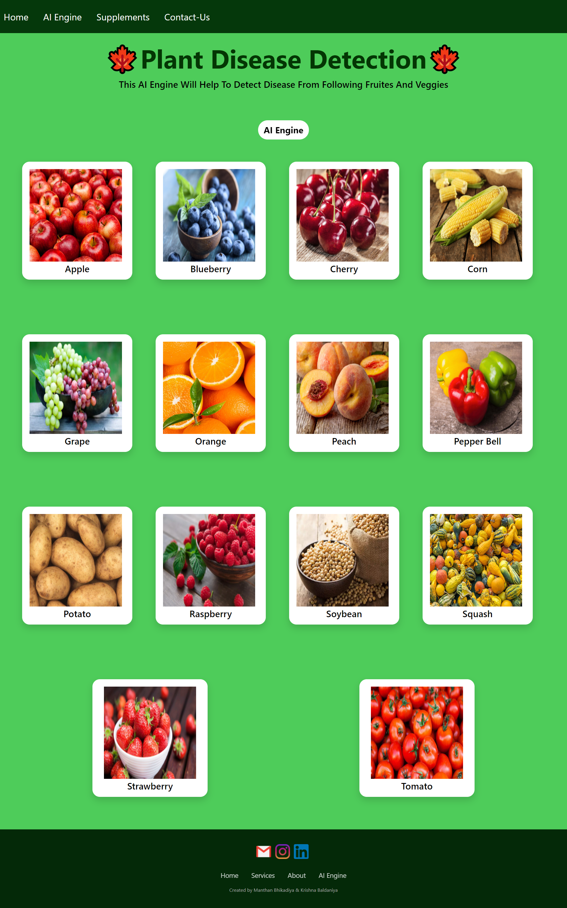
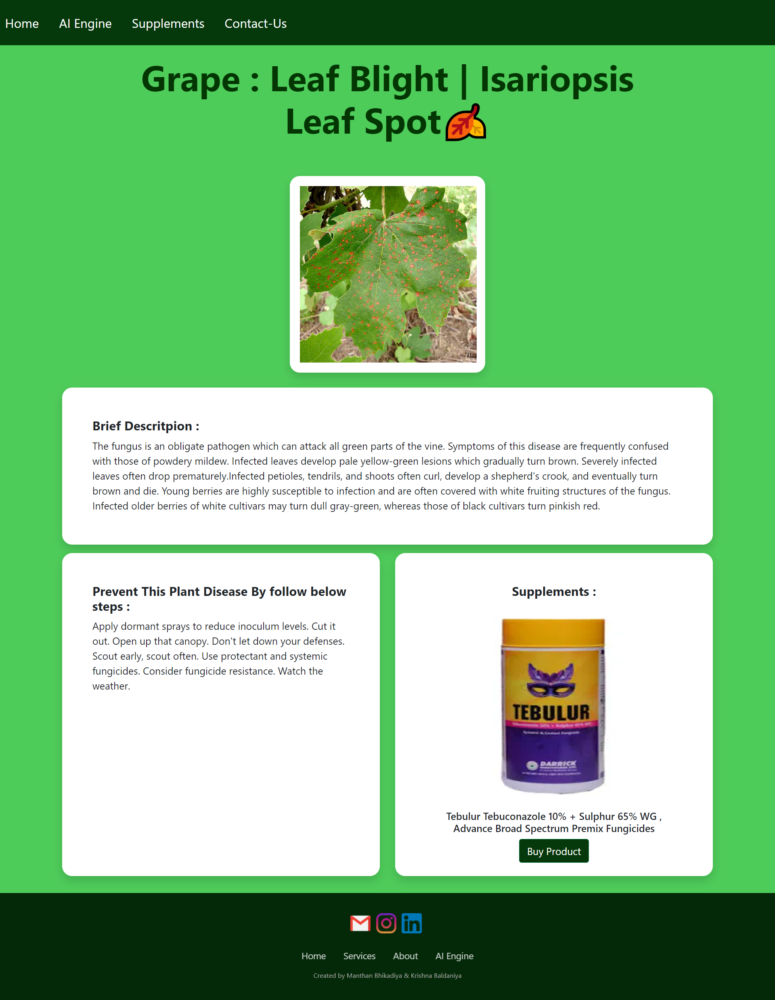

# 🌿 Plant Disease Detection

A **PyTorch + CNN + Flask** computer-vision application that classifies plant leaf images into **39 disease categories** using the PlantVillage dataset.

The project includes a trained model, test images, a Flask inference application and a web interface for uploading a leaf image and receiving a prediction.

## 🚀 Highlights

- 🧠 CNN-based image classification with PyTorch
- 🌱 39 plant/disease classes
- 🗃️ PlantVillage dataset
- 🌐 Flask inference application
- 🤗 Model hosted on Hugging Face and downloaded at runtime
- 🖼️ Included sample/test images
- 📊 Disease information and prevention guidance

## 🏗️ Architecture

    Leaf Image
        │
        ▼
    Flask Upload Endpoint
        │
        ▼
    Resize → Tensor Conversion
        │
        ▼
    PyTorch CNN
        │
        ▼
    Predicted Class
        │
        ├──> Disease information
        └──> Prevention information

## 🧰 Tech Stack

- Python
- PyTorch
- Torchvision
- CNN
- Flask
- NumPy
- Pandas
- Pillow
- Hugging Face Hub

## 📁 Repository Structure

    Plant-Disease-Detection/
    ├── Flask Deployed App/
    │   ├── app.py
    │   ├── CNN.py
    │   ├── disease_info.csv
    │   ├── supplement_info.csv
    │   ├── templates/
    │   └── static/
    ├── Model/
    ├── demo_images/
    ├── test_images/
    └── README.md

## ⚙️ Local Setup

The original inference application uses an older PyTorch stack, so the most reliable approach is to use the versions specified in the application requirements.

    git clone https://github.com/Vaibhav1536/Plant_Disease_Detection.git
    cd Plant_Disease_Detection/Plant-Disease-Detection/Flask Deployed App

    python -m venv .venv

Windows:
    .venv\Scripts\activate

    pip install -r requirements.txt
    python app.py

Open the local Flask address shown in the terminal.

## 🤗 Model

The Flask application downloads the trained model from the Hugging Face Hub at startup, so the large model file does not need to be committed to this Git repository.

## 🧪 Testing

Sample leaf images are available in test_images/. Upload one through the web application to verify the inference pipeline.

## 🖥️ Screenshots

### Main Page

### AI Engine

### Prediction Result

## ⚠️ Limitations

- Performance depends on image quality, lighting and similarity to the training distribution.
- PlantVillage-style datasets may not fully represent real-world field conditions.
- The model should be treated as a decision-support tool, not a substitute for expert agricultural diagnosis.

## 🔭 Future Improvements

- Add confidence scores and top-k predictions
- Improve field-image robustness with augmentation and diverse datasets
- Add model explainability using Grad-CAM
- Add an API endpoint for programmatic inference
- Upgrade the legacy dependency stack and add automated tests
